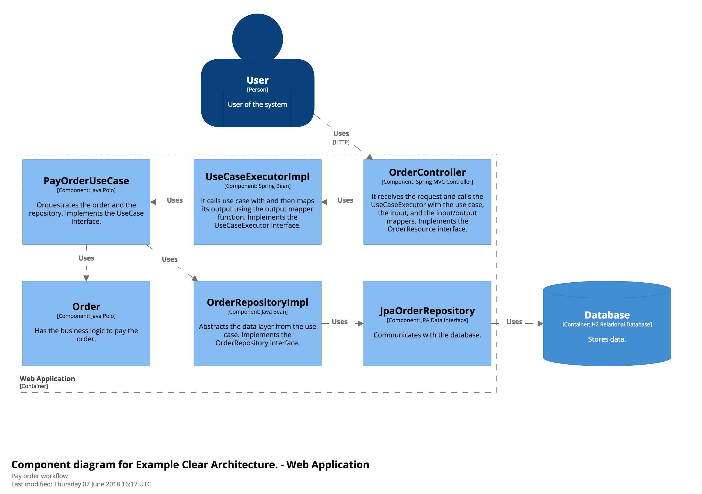

# Clean Architecture Example

## Description

The architecture of the project follows the principles of Clean Architecture. It is a simple food delivery app. One can list stores, cousines, products and create food orders. JWT it is used for authentication.

## Running

`./gradlew bootRun`

## Architecture

The project consists of 3 packages: *core*, *data* and *presenter*.

### *core* package

This module contains the domain entities and use cases.
This module contains the business rules that are essential for our application.
In this module, gateways for the repositories are also being defined.
There are no dependencies to frameworks and/or libraries and could be extracted to its own module.

### *data* package

### *presenter* package

## Diagram

Here is a flow diagram of the payment of an order.

